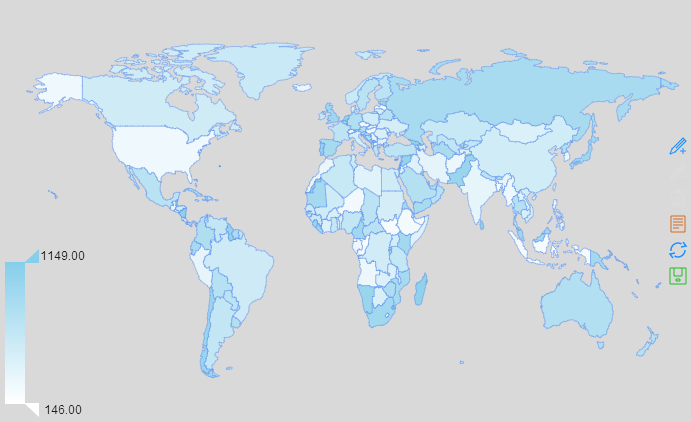
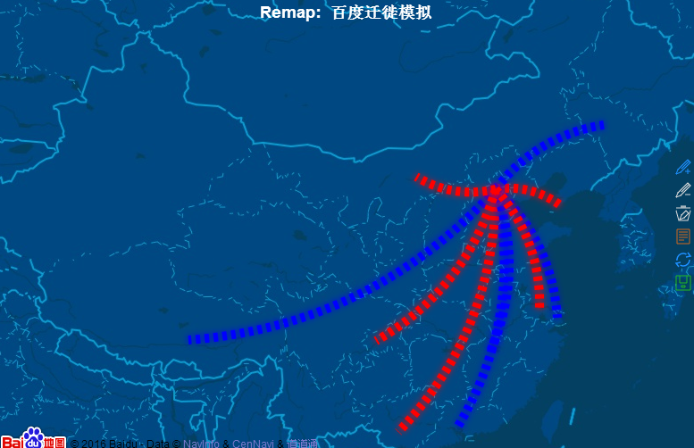

### 目录
1. [安装](#install)
2. [使用](#usage)
    + 2.1 [获取经纬度](#getcoord)
    + 2.2 [函数remap---绘制迁徙地图](#remap)
    + 2.3 [函数remapC---创建分级统计图](#remapC)
    + 2.4 [函数remapB](#remapB)
3. [其他例子](#example)

REmap是一个基于Echarts <http://echarts.baidu.com> 的一个R包。主要的目的是为广大数据玩家提供一个简便的,可交互的地图数据可视化工具。目前托管在github, 地址为<https://github.com/lchiffon/REmap>。

## 1. 安装 {#install}
```{r eval=FALSE}
library(devtools)
install_github('lchiffon/REmap')
```
* 提示:请使用Chrome或者Firefox来作为默认浏览器

## 2. 使用 {#usage}

### 2.1 获取经纬度 {#getcoord}
获取经纬度的函数是基于BaiduAPI的一个获取地理位置的功能。这个函数不仅是REmap下的一个功能，实际上你也可以用它来抓取经纬度数据。

基本函数:

`get_city_coord()` 获取一个城市的经纬度。

`get_geo_position()` 获取一个城市向量的经纬度。

```{r eval=FALSE}
library(REmap)
city_vec = c("北京","Shanghai","广州")
get_city_coord("Shanghai")
get_geo_position (city_vec)
```
**注**: windows用户会看到city一列为utf-8编码,可以使用`get_geo_position (city_vec2)$city`查看列向量的信息

### 2.2 函数remap---绘制迁徙地图 {#remap}
绘制迁徙地图使用的是主函数`remap()`
```{r eval=FALSE}
remap(mapdata, title = "", subtitle = "", theme =get_theme("Dark"))
```

* mapdata: 一个数据框对象,第一列为出发地点,第二列为到达地点
* title: 标题
* subtitle: 副标题
* theme: 控制生成地图的颜色,具体将会在get_theme部分说明

```{r eval=FALSE}
set.seed(125)
origin = rep("北京",10)
destination = c('上海','广州','大连','南宁','南昌','拉萨','长春','包头','重庆','常州')
dat = data.frame(origin,destination)
out = remap(dat,title = "REmap实例数据",subtitle = "theme:Dark")
plot(out)
```


该地图会写成一个html文件,保存在电脑里面,并通过浏览器打开该文件.以下的方式都可以看到这个地图:

```{r eval=FALSE}
## Method 1
remap(dat,title = "REmap实例数据",subtitle = "theme:Dark")
## Method 2 
out = remap(dat,title = "REmap实例数据",subtitle = "theme:Dark")
out
## Method 3
out = remap(dat,title = "REmap实例数据",subtitle = "theme:Dark")
plot(out)
```

REmap中`get_theme`提供了迁徙地图中常用颜色的调整:
```{r eval=FALSE}
get_theme(theme = "Dark", lineColor = "Random",
          backgroundColor = "#1b1b1b", titleColor = "#fff",
          borderColor = "rgba(100,149,237,1)", regionColor = "#1b1b1b")
```
* theme: 默认主题,除了三个内置主题,可以使用“none”来自定义颜色
    + a character object in (“Dark”,“Bright,”Sky“,”none“)
* lineColor: 线条颜色,默认随机,也可以使用固定颜色
    + Control the color of the line, “Random” for random color
* backgroundColor: 背景颜色
    + Control the color of the background
* titleColor: 标题颜色
    + Control the color of the title
* borderColor: 边界颜色(省与省之间的信息)
    + Control the color of the border
* regionColor: 区域颜色
    + Control the color of the region

颜色可以使用颜色名(比如’red’,’skyblue’等),RGB(“#1b1b1b”,“#fff”)或者一个rgba的形式(“rgba(100,100,100,1)”),可以在这里找到颜色对照表.

* 默认模板: Bright

```{r warning=FALSE, message=FALSE, eval=FALSE}
## default theme:"Bright"
set.seed(125)
out = remap(dat,title = "REmap实例数据",subtitle = "theme:Bright",
            theme = get_theme("Bright"))
plot(out)
```


```{r warning=FALSE, message=FALSE, eval=FALSE}
## 更改线条颜色 set Line color as 'orange'
set.seed(125)
out = remap(dat,title = "REmap实例数据",subtitle = "theme:Bright",
            theme = get_theme("None", lineColor = "orange"))
plot(out)
```


```{r warning=FALSE, message=FALSE, eval=FALSE}
## 更改其他颜色 Set Region Color
out = remap(dat,title = "REmap实例数据",subtitle = "theme:Bright",
            theme = get_theme("None",
                              lineColor = "orange",
                              backgroundColor = "#FFC1C1",
                              titleColor = "#1b1b1b",
                              regionColor = '#ADD8E6'))
plot(out)
```


### 2.3 函数remapC---创建分级统计图 {#remapC}
`remapC`是用于创建分级统计图(Choropleth map).即根据子区域数值的多少进行深浅不同的颜色填充的地图形式.目前支持的地图为:

1. ‘china’ 中国省份地图
2. ‘world’ 世界地图
3. 各省市地图,如’广东’,’西藏’等…

remapC函数的调用形式为:
```{r eval=FALSE}
remapC(data,
       maptype = 'china',
      color = c('#1e90ff','#f0ffff'),
      theme = get_theme("Bright"),
      title = "",
      subtitle = "",
      mindata = NA,
      maxdata = NA,
      # mark Line & point
      markLineData = NA,
      markPointData = NA,
      markLineTheme = markLineControl(),
      markPointTheme = markPointControl(),
      geoData = NA)
```

参数看起来很多,这里仅描述前几个参数,后面的`markLine`与`markPoint`是用于在绘制好的地图上添加标线和标点的,会在`remapB`中详细介绍,`remapC`中重要的参数有:

* data: 数据框,第一列为子区域名(比如全国地图的省名,省级地图的市名)
* color: 传入单个颜色就使用从白色到该色的填充,多个颜色根据值大小计算填充颜色
* maptype: 地图的格式,’china’代表中地图,’world’代表世界地图

用示例数据`chinaIphone`来做演示:
```{r}
library(REmap)
head(chinaIphone)
```

```{r eval=FALSE, message=FALSE, warning=FALSE}
remapC(chinaIphone)
```


更改`color`参数来调整颜色:
```{r eval=FALSE, message=FALSE, warning=FALSE}
remapC(chinaIphone, color = 'orange') ## 颜色改为白色到橘红色
remapC(chinaIphone, color = c('orange','red')) ## 颜色改为红色到橘红色
```


此外,使用`mapType`参数可以改变地图的类型,绘制子地图或者世界地图:
```{r}
data = data.frame(country = mapNames("world"), value = 5*sample(178)+200)
head(data)
```

```{r eval=FALSE}
remapC(data,maptype = "world",color = 'skyblue')
```


其中**`mapNames()`**函数可以得到某个地图下的子图信息:
```{r}
mapNames('西藏')
```

```{r}
data = data.frame(country = mapNames('西藏'), value = 50*sample(7)+200)
head(data)
```

```{r eval=FALSE}
remapC(data,maptype = '西藏',color = 'skyblue')
```


其他的参数: 

* theme: 地图的主题,里面可以设置背景颜色,标题颜色,边界颜色等 
* title,subtitle: 标题与附标题 
* max,min: dataRange的最大最小值

比如,精细的调整一下最初的地图:
```{r eval=FALSE}
remapC(chinaIphone,
        title = "remapC实例地图",
        theme = get_theme('none',backgroundColor = '#fff',
                          titleColor = "#1b1b1b",
                          pointShow = T),
        max = 2000)
```


最后,再演示下remapC中使用markLine和markPoint的效果:
```{r eval=FALSE}
remapC(chinaIphone,
        title = "remapC实例地图",
        theme = get_theme('none',backgroundColor = '#fff',
                          titleColor = "#1b1b1b",
                          pointShow = T),
        max = 2000,
        markLineData = demoC,
        markPointData = demoC[,2])
```


### 2.4 函数remapB {#remapB}
`remapB`是用于创建一个以百度地图为底图的recharts效果,有以下特点:

1. 支持滚轮缩放,拖拽地图
2. 详细的地图效果
3. 可视化主要以标线与标点的形式做出

remapB函数的调用形式为:
```{r eval=FALSE}
remapB(center = c(104.114129,37.550339),
       zoom = 5,
       color = "Bright",
       title = "",
       subtitle = "",
       markLineData = NA,
       markPointData = NA,
       markLineTheme = markLineControl(),
       markPointTheme = markPointControl(),
       geoData = NA)
```

先说除去markline和markpoint的参数:

* center: 地图的中心(经纬度坐标),可以从`get_city_coord`获得
* zoom: 地图缩放尺寸,越小地图越大,(5代表国家级的地图,15代表市级的地图)
* color: 地图的颜色风格,目前仅开放了“Bright”和“Blue”,两种,细节调整参见百度地图API来修改html的源代码

先来看下没有标点和标线的Bmap效果:
```{r eval=FALSE}
remapB()
```


可以用remapB来查看某个城市的地图
```{r eval=FALSE}
remapB(get_city_coord("北京"), zoom = 12)
```


换一个theme:
```{r eval=FALSE}
remapB(color = "Blue")
```


简单演示下remapB中使用markLine和markPoint的效果:
```{r eval=FALSE}
remapB(title = "Bmap 迁徙图示例",
        color = "Blue",
        markLineData = demoC,
        markPointData = demoC[,2])
```


#### markLine
`markLine`是Echarts中进行标线的工具.通过标线(直线,曲线),可以完成很多有意思的可视化

先说一下markLine相关的参数,这些参数可以在remapC或者remapB中调用:

* markLineData 标线使用的数据,第一列为出发地,第二列为目的地
* markLineTheme 控制标线颜色,形状等,由markLineControl来控制
* geoData 标中各个点的经纬度坐标,如果没有,会使用BaiduAPI自动查找

一个简单的示例:
```{r eval=FALSE}
remapB(title = "Remap:  百度迁徙模拟",
       color = "Blue",
       markLineData = demoC)
```


#### markLineTheme

`markLineTheme`控制了标线的风格,使用`markLineControl`来调用,这里列出主要的参数:

```{r eval=FALSE}
markLineControl(symbolSize = c(2,4),
      smoothness = 0.2,
      effect = T,
      lineWidth = 1,
      lineType = 'solid',
      color = "Random") 
```

* SymbolSize:
    + 形状的大小,标线默认是一段无形状,一段箭头,如果不想要箭头可以使用symbolSize = c(0,0)
* smoothness:
    + 曲线的弯曲度,取0标线会退化为直线
* effect:
    + 炫光特效,标线较多的时候建议关闭
* lineWidth:
    + 标线的宽度
* lineType:
    + 标线的样式: ’solid’实线’dotted’点线或者 ’dashed’虚线
* color:
    + 颜色,默认为随机颜色,设置一个颜色会取为固定颜色
    + 此外对markLineData下设置color变量会覆盖该颜色

```{r eval=FALSE}
remapB(title = "Remap:  百度迁徙模拟",
       color = "Blue",
       markLineData = demoC,
       markLineTheme = markLineControl(symbolSize = c(0,0),
                                       lineWidth = 10,
                                       lineType = 'dashed'))
```


设置额外的颜色:

```{r eval=FALSE}
demoC$color = sample(c("red","blue"),10,replace = T)

remapB(title = "Remap:  百度迁徙模拟",
       color = "Blue",
       markLineData = demoC,
       markLineTheme = markLineControl(symbolSize = c(0,0),
                                       lineWidth = 10,
                                       effect = F,
                                       lineType = 'dashed'))
```


#### geoData

mapC和mapB中,都会有geoData这个变量,用以储存markLine和markPoint的地理位置信息.具体的格式与`get_city_coord`返回相同:

* 第一列lon
* 第二列lat
* 第三列地理名称

```{r}
get_geo_position(c("Beijing","Shanghai","Guangzhou"))
```

下面是一个例子,通过这个例子可以看到markLine的使用方式:

##### Example:地铁线路可视化

这里,我们使用REmap中自带的`subway`来进行演示,是上海地铁一号线的线路信息,其中`subway[[1]]`为各个点的经纬度坐标,`subway[[2]]`为各个点的连线方式.(数据来源于百度API)

各个点的经纬度坐标
```{r}
head(subway[[1]])
```

各个点的连线方式
```{r}
head(subway[[2]])
```

```{r eval=FALSE}
remapB(center = get_city_coord("上海"),
       zoom = 13,
       title = "Remap:  上海地铁一号线",
       color = "Blue",
       markLineData = subway[[2]],
       markLineTheme = markLineControl(smoothness = 0,
                                       effect = T,
                                       symbolSize = c(0,0)),
       geoData = subway[[1]])
```


#### markPoint
`markPoint`是Echarts中进行标点的工具.通过不同形状的点(箭头,星,圆或者自定义的图片)来完成点的标注

与markLine类似,markPoint相关的参数,可以在remapC或者remapB中调用:

* markPointData 标点使用的数据,可以是一个向量,如果是数据框就仅使用第一列
* markPointTheme 控制标点颜色,形状等,由markPointControl来控制
* geoData 标中各个点的经纬度坐标,如果没有,会使用BaiduAPI自动查找

一个简单的示例:
```{r eval=FALSE}
remapB(title = "Remap:  百度迁徙模拟",
       color = "Blue",
       markPointData = demoC[,2])
```


#### markPointTheme
`markPointTheme`控制了标线的风格,使用`markPointControl`来调用,这里列出主要的参数:

```{r eval=FALSE}
markPointControl(symbol = 'emptyCircle',
                  symbolSize = "Random",
                  effect = T,
                  effectType = 'scale',
                  color = "Random")
```

* symbol:
    + ‘circle’,‘emptyCircle’,圆,空心圆
    + ‘rectangle’,‘emptyRectangle’,方块,空心方块
    + ‘triangle’,‘emptyTriangle’,三角,空心三角
    + ‘diamond’,‘emptyDiamond’,钻石,空心钻石
    + ‘heart’心形,’droplet’,水滴
    + ‘pin’,POI标注,’arrow’箭头, ’star’五角星
    + 或者使用’image://http://….’来引用一个图片
    + 此外对markLineData下设置symbol变量会覆盖该颜色
* symbolSize:
    + 标点的大小
* effect:
    + 炫光特效,标线较多的时候建议关闭
* effectType:
    + 炫光特效的方式,’scale’放大,或者’bounce’跳动
* color:
    + 颜色,默认为随机颜色,设置一个颜色会取为固定颜色
    + 此外对markLineData下设置color变量会覆盖该颜色

```{r eval=FALSE}
remapB(title = "Remap:  markPoint示例",
       color = "Blue",
       markPointData = demoC[,2],
       markPointTheme = markPointControl(symbol ="diamond",
                        symbolSize = 7,
                        effect = T,
                        effectType = 'bounce'))
```


#### geoData

mapC和mapB中,都会有geoData这个变量,用以储存markLine和markPoint的地理位置信息.具体的格式与`get_city_coord`返回相同:

* 第一列lon
* 第二列lat
* 第三列地理名称

```{r}
get_geo_position(c("Beijing","Shanghai","Guangzhou"))
```

下面的例子,结合了上一节的地铁信息,增加了一些POI的店铺信息

##### Example:地铁线路可视化
这里,我们使用REmap中自带的`geoData`来进行演示,数据是是上海自助餐与火锅的POI位置信息,一共30条(数据来源于百度API)
数据是如下的样子:
```{r echo=FALSE}
head(geoData)
```

绘制点图
```{r eval=FALSE}
#前20个标注为天蓝色,后10个标注为红色
pointData = data.frame(geoData$name,
                       color = c(rep("skyblue",20),
                                 rep("red",10)))

remapB(get_city_coord("上海"),
       zoom = 13,
       color = "Blue",
       title = "上海美食",
       markPointData = pointData,
       markPointTheme = markPointControl(symbol = 'pin',
                                         symbolSize = 5,
                                         effect = F),
       geoData = geoData)
```


当然在一个地图中可以混合标点与标线的信息
```{r eval=FALSE}
names(geoData) = names(subway[[1]])
remapB(get_city_coord("上海"),
       zoom = 13,
       color = "Blue",
       title = "Remap:  MarkPoint&MarkLine",
       markPointData = pointData,
       markPointTheme = markPointControl(symbol = 'pin',
                                         symbolSize = 5,
                                         effect = F),
       markLineData = subway[[2]],
       markLineTheme = markLineControl(symbolSize = c(0,0),
                                       smoothness = 0),
       geoData = rbind(geoData,subway[[1]]))
```


## 3. 其他例子 {#example}

### 3.1 图片做点和图片做为展示内容

```{r eval=FALSE}
## 读取数据
rCon = read.csv("data/R-con.csv",encoding = "UTF-8")
## 准备数据
rCon$pic = paste0("")
plotdata = data.frame(place = rCon$place,
                      symbol = "image://./fig/cos.png",
                      tooltip = paste(rCon$name,rCon$time,rCon$pic,sep = "<br/>"))
## 绘制地图
remapC(data = chinaIphone,
         color = c("white","white"),
         markPointData = plotdata,
         markPointTheme = markPointControl(effect = F, symbolSize = 30),
         title = "2015中国R语言会议")
```
细心的人可能会发现，上面的代码运行之后并不会出现cos.png作为点的我们想要的那种图形那是因为结果上面使用的是相对路径，而程序运行后产生的临时html的路径与我们的当前路径是不同的。你所要做的就是保存完整的临时html到当前路径下，在重新打开就OK了。


**声明:** 本笔记内容并非原创，主要来自于：
<http://lchiffon.github.io/>中的REmap手册。


